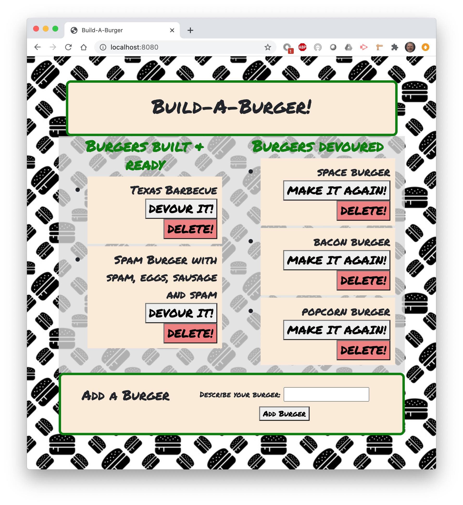

# Build-A-Burger
Node Express Handlebars homework
## Description
A restaurant type database to display burgers available on one side and burgers eaten on the other side. new burgers can be created and old ones can be deleted from the database.  

Guthub repo: https://github.com/macksm3/Build-A-Burger 
Heroku live app: 

## Table of Contents 

* [Installation](#installation)
* [Usage](#usage)
* [Contributers](#contributers)
* [License](#license)

## Installation
This app resides on the Heroku server and is accessed with a web browser.

## Usage
The app is a database of burgers. User can add new burgers, mark burgers as eaten and then make them again, as well as delete burgers from the database. 

## License
The Unlicense.

## Badges

[]
(https://unlicense.org)

